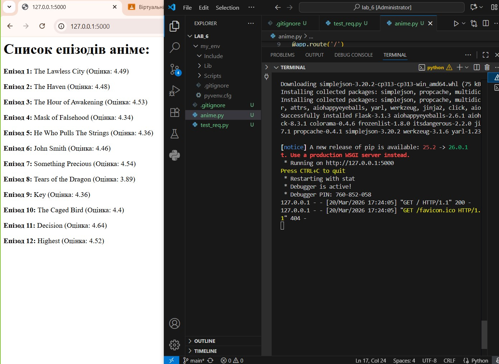
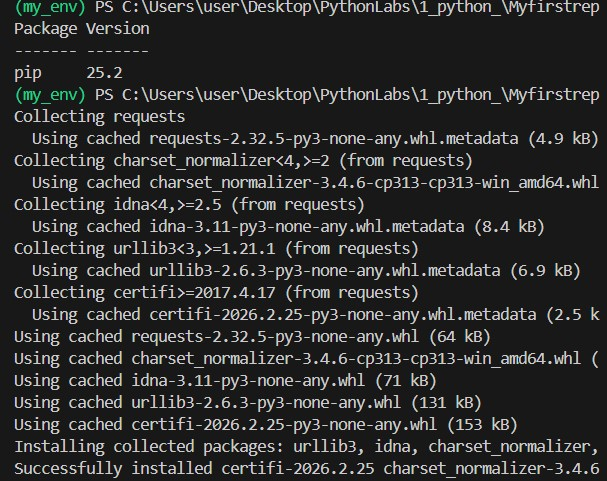
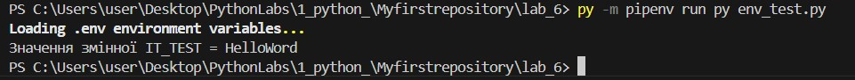
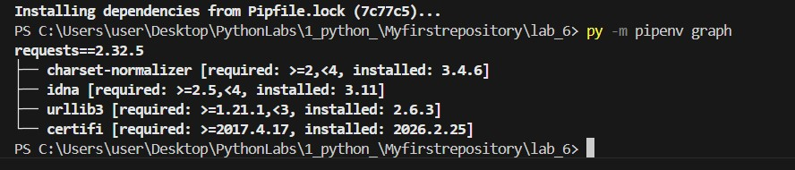
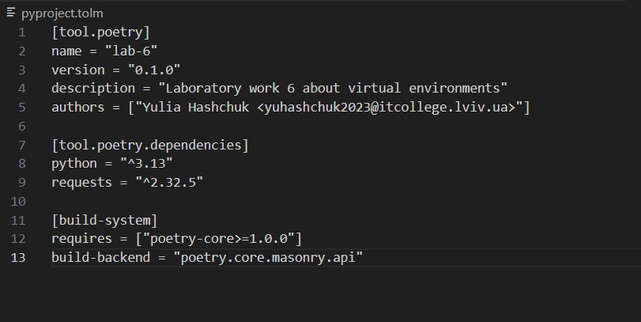

# Звіт до лабораторної роботи №6

Тема: Керування віртуальними середовищами та пакетами в Python.

Мета роботи: Ознайомитися з інструментами створення ізольованих середовищ (venv), навчитися працювати з менеджерами пакетів Pipenv та Poetry, а також опанувати використання змінних оточення через файли .env.


## Виконання роботи

### Результати виконання завдання 1: Робота з VENV та Flask

* Розробили/Створили: Було створено віртуальне середовище my_env та веб-додаток anime.py з використанням бібліотек Flask та jikanpy.

* Програма вивела значення: Список епізодів аніме "Sousou no Frieren" безпосередньо у вікно браузера.

* Отримано наступні результати: Навчилися ізолювати залежності проєкту від глобальних пакетів системи.




### Результати виконання завдання 2: Робота з Pipenv та .env

* Розробили/Створили: Налаштували менеджер Pipenv, створили файли Pipfile та .env.

* Програма вивела значення: Значення секретної змінної IT_TEST=HelloWorld через скрипт env_test.py.

* Навчились: Використовувати змінні середовища для безпечного зберігання конфігурацій.




### Результати виконання завдання 3: Робота з Poetry
* Розробили/Створили: Сформували файл конфігурації проєкту pyproject.toml для керування метаданими та залежностями.
* Отримано наступні результати: Опанували сучасний стандарт пакування Python-проєктів.




## Вихідний код програм

### Тестовий скрипт Requests
(./pictures/test.jpg)

### Веб-додаток Anime (Flask)
```python
from flask import Flask
from jikanpy import Jikan

jikan = Jikan()
app = Flask(__name__)

j = jikan.anime(54595, extension='episodes')

@app.route('/')
def home():
    output = "<h1>Список епізодів аніме:</h1>"
    for episode in j["data"]: 
        output += f"<p><b>Епізод {episode['mal_id']}:</b> {episode['title']} (Оцінка: {episode['score']})</p>"
    return output

if __name__ == '__main__':
    app.run(debug=True)


 ## Висновок

• Що зроблено в роботі: Створено та налаштовано три типи віртуальних середовищ (venv, Pipenv, Poetry), реалізовано веб-сервер на Flask.

• Чи досягнуто мети роботи: Так, мета повністю досягнута.

• Які нові знання отримано: Навички роботи з API (Jikan), ізоляція пакетів, робота з конфігураційними файлами .toml та .lock.

• Чи вдалось відповісти на всі питання: Так, усі етапи задокументовано.

• Чи вдалося виконати всі завдання: Так, включаючи роботу з Poetry та .env.

• Чи виникли складності: Виникли труднощі з налаштуванням PATH у PowerShell, які були успішно вирішені використанням лаунчера py.

• Feedback: Формат роботи дуже цікавий, особливо частина з розробкою веб-сторінки на основі реальних даних аніме.

• Suggestions: Додати більше прикладів роботи з Poetry для складних проектів.